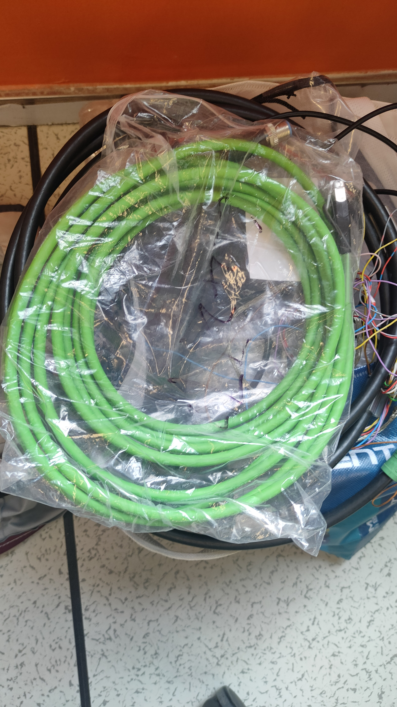
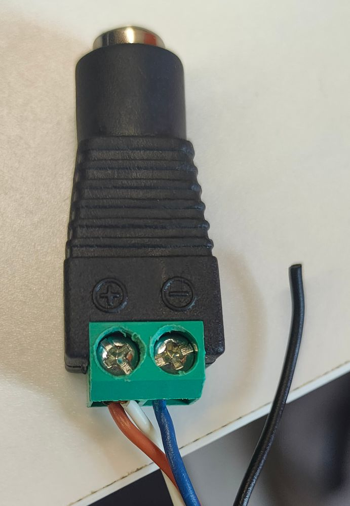
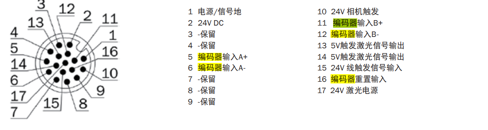
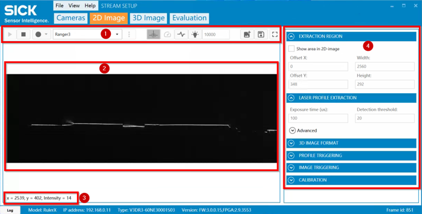
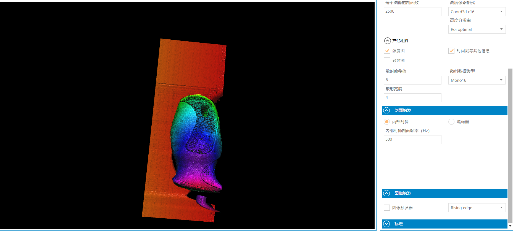
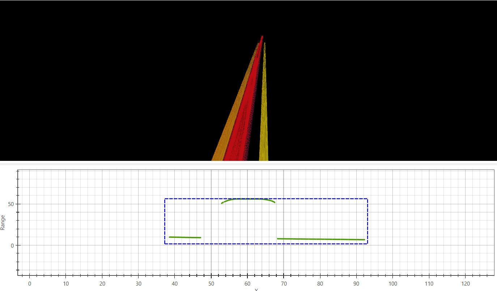

## 3D相机
该说明文档针对西克3D相机（SICK RulerXR 150），该相机为测试版，手册较少可以参考该文档。_注打开该文档应放在文件夹下，否则图片无法正常显示。_

### 相机接线
相机接线如下图所示：
，相机共有三个线，分别为：绿色数据线、黑色(粗)电源线以及黑色(细)电源线。每个线的接口形状不同，**插入时应注意方向，对准了再插**。
其次应注意供电线的电气属性，**黑色细线为激光供电，应接5V的适配器上，黑色粗线为相机供电，应接在24V的适配器上**。小黑线的接线如图所示

注意接线时的正负方向，以及触发信号线需要拉高。
大黑线接线参考
影射实际接线为**棕色->0V，蓝色->24V**。
### 相机控制
相机使用主要通过这两个IDE使用
Stream Setup为控制相机采集，以及部分数据处理，EzR软件为控制数据处理。
#### 相机原理
西克3D相机使用的是类似线阵相机的成像原理，通过扫描截面的过程中相对运动，将界面信息相互叠加进行成像
因此成像过程中，首先设置2D的扫描参数，既每一次采样的宽度与深度在上图中即为**自由度2和4**。之后需要设置采样频率(如果有编码器需要设置编码器的采样间隔)，设置完成后如果相机实际的采集的物体的运动速度与采样频率相互契合，即可得到不形变的物体。
#### Stream Setup
具体文档参照[SICK Stream Setup User Guide](./picture/Stream%20Setup软件培训_V8.0.0.2634_20220526.pptx)。
使用过程中，笔者还发现下面技巧掌握后便于使用：
1. 设置2D相机刨面图的参数是十分重要的，他影响后续的采样深度与宽度，在2中首先采样得到图片，之后暂停采样设置AOI区域(可以直接在图像中拖动采样框)，如果采样高度大，即可采样更深的信息，宽度大，视野越宽相对应的采样频率以及数据大小也会变化。
2. 3D采样时比较重要的参数为刨面数以及内部时钟的采样频率(非编码器采样)。刨面数越多说明3D图像越长，一张图的信息越多。物体移动速度越快，采样频率需要越快。设置时建议将采样频率与刨面数设置为整除关系（eg：刨面数2500，时钟500既每秒采样500个泡面5s显示一张图）。
3. 在评估界面(Evaluation)中，可以设置图像采集的部分算法，可以设置滤波、高度信息等，可以配合采样使用。

#### EzR
前面的区域之后再来探索吧。。。。
EzR文档很少，可以参考[EzR User Guide](./EvR/Tutorial%201%20-%20Getting%20Started.pdf)文档，_附赠 一个env文件_。使用时注意激活软件，[licence](./EvR/2023_10_EasyRanger7050.ezrlic)文件将在2024/10/12号左右过期。激活后可以切换中文，在帮助文档页面进行学习。**使用该软件，必须把软件以及数据放在英文路径下，否则有bug。**